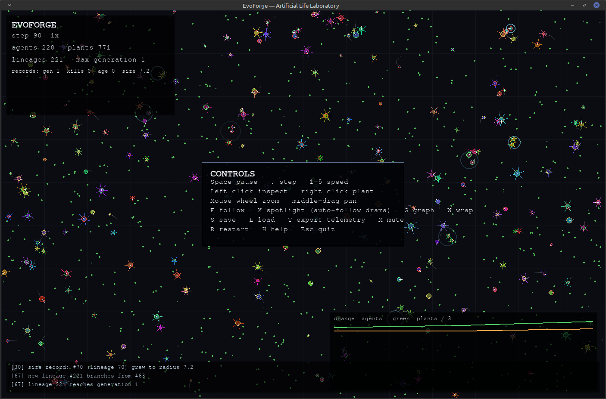

# EvoForge

EvoForge is an interactive artificial-life laboratory written in Python.

It simulates a persistent 2D ecosystem where neural agents:

- sense food, danger, population density, and world boundaries
- spend energy to move
- eat plants or other agents according to evolved dietary traits
- reproduce when healthy
- pass mutated genomes to descendants
- form lineages that can dominate, diversify, or go extinct
- evolve movement, vision, metabolism, aggression, size, fertility, and neural behavior

The simulation also includes:

- a spatial hash for efficient neighborhood queries
- compact neural networks encoded directly in genomes
- mutation and crossover
- lineage ancestry
- real-time population graphs
- speed controls and pause/step controls
- agent inspection
- JSON save/load
- CSV telemetry export
- deterministic seeds
- headless benchmarking
- optional world wrapping
- 
## 

228 agents, 771 plants, 221 lineages — a live run at step 90, agents (orange) evolving against plant population (green).

## Install

```bash
python3 -m pip install -e .
```

## Run

```bash
evoforge run
```

Larger world:

```bash
evoforge run --agents 400 --plants 1200 --width 1600 --height 900
```

Reproducible experiment:

```bash
evoforge run --seed 42
```

Headless benchmark:

```bash
evoforge benchmark --steps 5000 --agents 1000 --plants 2500
```

Load a saved world:

```bash
evoforge run --load world.json
```

## Controls

- `Space`: pause/resume
- `.`: single simulation step while paused
- `1`–`5`: simulation speed
- `F`: follow the selected agent
- `X`: spotlight mode — camera auto-follows whichever agent is currently most
  notable (rotates between top predator, oldest survivor, biggest organism,
  and most prolific parent every few seconds)
- `M`: mute/unmute event sounds
- `S`: save to `evoforge_save.json`
- `L`: load `evoforge_save.json`
- `T`: export telemetry CSV
- `R`: restart world
- `G`: toggle graph
- `H`: toggle help
- `W`: toggle world wrapping
- Left click: inspect nearest agent
- Right click: spawn plant
- Mouse wheel: zoom
- Drag middle mouse: pan
- `Esc`: quit

## Watch mode features

EvoForge is built to be left running as a screensaver-style simulation, not
just poked at once. A few things drive that:

- **Motion trails** — every organism leaves a short fading trail so movement
  reads as fluid life rather than a swarm of teleporting dots.
- **Organisms look like what they are** — aggression shows as spiky jabs
  around the body, vision range shows as bigger/more forward eyes, energy
  shows as a dim-vs-glowing body, and long-lived or prolific lineages earn a
  gold "elder" ring.
- **Event particles and sound** — births, kills, and deaths flash briefly at
  the spot they happened, with an optional soft chime (`M` to mute).
- **A live event ticker** at the bottom of the screen narrates what's
  happening: new lineages branching off, extinctions, longevity/size/kill
  records, and weather shifts.
- **Weather** — the world randomly drifts into resource "blooms" (plant
  surges) and "blights" (scarcity), so the ecosystem never fully settles into
  a static equilibrium.
- **Day/night tinting** — the background subtly shifts with the existing
  day/night cycle instead of staying a flat color.
- **Spotlight/director mode (`X`)** — auto-follows whatever's most dramatic
  right now instead of requiring you to manually hunt for it.

## What makes it interesting

No agent is given a scripted strategy. Every decision comes from a tiny neural
network whose weights are inherited and mutated. Selection pressure comes from
the world itself: energy, food availability, predation, reproduction cost,
crowding, and survival.

Over time, lineages can evolve into grazers, ambush predators, fast scavengers,
slow efficient organisms, or unstable dead ends.

This is not intended as a biological model. It is a programmable experiment in
emergence, optimization, and unintended behavior.
